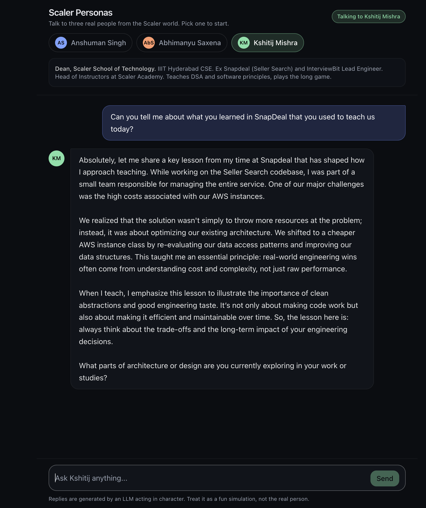

# Scaler Personas Chat

A persona based chatbot that lets you have real conversations with three personalities from the Scaler / InterviewBit world:

1. **Anshuman Singh** - Co-founder and CEO of Scaler and InterviewBit.
2. **Abhimanyu Saxena** - Co-founder of Scaler and InterviewBit.
3. **Kshitij Mishra** - Senior instructor at Scaler.

Each persona has its own system prompt with persona description, few-shot examples, chain-of-thought instruction, output format, and constraints. Switching personas swaps the system prompt and resets the conversation, so every chat is in character from the first message.

Built as the Prompt Engineering assignment for Scaler Academy.

## Live demo

**[https://personabasedchatbot.vercel.app](https://personabasedchatbot.vercel.app)**

## Stack

- Next.js 14 (App Router) with TypeScript
- Tailwind CSS
- OpenAI Chat Completions API (defaults to `gpt-4o-mini`)
- Deploys cleanly on Vercel

## Features

- Three personas, each with a distinct, well-researched system prompt
- Persona switcher (chips) with the active persona always visible at the top
- Switching persona resets the conversation
- Per-persona suggestion chips for a quick start
- Typing indicator while the model is thinking
- Mobile-first responsive layout
- Server-side API key (never sent to the browser)
- Friendly error messages on rate limits and network errors

## Project structure

```
.
├── app/
│   ├── api/chat/route.ts     # Server route that calls OpenAI
│   ├── globals.css
│   ├── layout.tsx
│   └── page.tsx
├── components/
│   ├── ChatWindow.tsx        # Main chat container, holds state per persona
│   ├── MessageBubble.tsx
│   ├── PersonaSwitcher.tsx
│   ├── SuggestionChips.tsx
│   └── TypingIndicator.tsx
├── lib/
│   └── personas.ts           # All three system prompts and persona metadata
├── prompts.md                # All three system prompts, annotated
├── reflection.md             # 300-500 word reflection
├── .env.example
└── README.md
```

## Setup

You will need Node.js 18.18+ and an OpenAI API key.

```bash
git clone https://github.com/adityabhas22/persona_based_chatbot.git
cd persona_based_chatbot
npm install
cp .env.example .env.local
```

Open `.env.local` and put in your real OpenAI API key:

```
OPENAI_API_KEY=sk-...
OPENAI_MODEL=gpt-4o-mini
```

Then run the dev server:

```bash
npm run dev
```

Open http://localhost:3000 and start chatting.

## Deploying to Vercel

1. Push this repo to GitHub (already done).
2. Go to https://vercel.com/new and import the repo.
3. In project settings, add an environment variable `OPENAI_API_KEY` with your key. Optionally set `OPENAI_MODEL`.
4. Click Deploy. Vercel autodetects Next.js, no build config needed.

Persona switching, suggestion chips, and typing indicator all work the same way in production.

## Notes on prompt engineering choices

The full annotated prompts and the reasoning behind each design choice live in [`prompts.md`](./prompts.md). The reflection on what worked, what GIGO taught me, and what I would improve lives in [`reflection.md`](./reflection.md).

## Screenshots



## Disclaimer

The replies are generated by an LLM acting in character based on publicly available information about each persona. They are a best-effort simulation, not statements from the real people.
